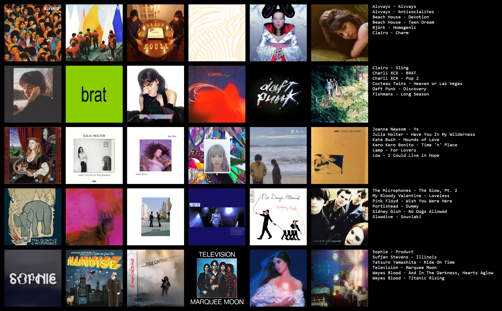

I'm a huge music fan! I love exploring new music, talking about music with people, and going to concerts. I listen to a lot of genres, but my main ones are indie pop, dream pop, art pop, slowcore, and alternative rock. Below is a collage of (some of) my favorite albums:

Speaking of music, I have played clarinet for over 10 years, and enjoy playing in bands, orchestras, and chamber ensembles in academic, community, festival, and summer camp settings. I currently play in Georgia Tech's Concert Band. I also served as a music teacher in Seven Mile, a University of Michigan student organization that provides weekly music lessons to kids in the city of Detroit, from 2017 to 2021.

I also enjoy good food, and whenever I travel to a new city or region, one of my first priorities is to seek out food places. Here are some food highlights for me in 2022:

My other hobbies include cooking, baking, gaming, and watching YouTube videos.

You can [contact](https://yma17.github.io/contact/) me anytime if you'd like to talk anything music, food, or anything else :)